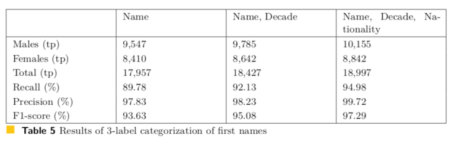

# Journal publication (JDIQ) got accepted.
Our work was accepted at the Journal of Data and Information Quality (JDIQ) Volume 11 Issue 2, May 2019. Here you can find the article.

### Abstract:
Mappings of first name to gender have been widely recognized as a critical tool for the completion, study, and validation of data records in a range of areas. In this study, we investigate how organizations with large databases of existing entities can create their own mappings between first names and gender and how these mappings can be improved and utilized. Therefore, we first explore a dataset with demographic information on more than 4 million people, which was provided by a car insurance company. Then, we study how naming conventions have changed over time and how they differ by nationality. Next, we build a probabilistic first-name-to-gender mapping and augment the mapping by adding nationality and decade of birth to improve the mapping’s performance. We test our mapping in two-label and three-label settings and further validate our mapping by categorizing patent filings by gender of the inventor. We compare the results with previous studies’ outcomes and find that our mapping produces high-precision results. We validate that the additional information of nationality and year of birth improve the precision scores of name-to-gender mappings. Therefore, the proposed approach constitutes an efficient process for improving the data quality of organizations’ records, if the gender attribute is missing or unreliable.

### Main finding:

  

